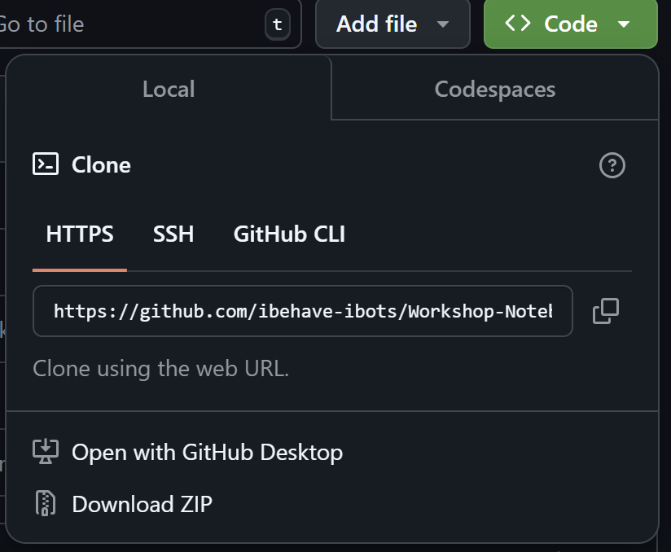

# Working with Remote Repositories in Git  

In this unit, we will learn how to connect a local Git repository to GitHub, clone an existing repository to work locally, and fork repositories to contribute to open-source projects or collaborate with others. GitHub provides a platform for storing repositories online, enabling version control, collaboration, and backup of your work. This unit covers essential commands for working with remote repositories.  

---

## Setup instructions 

### Create a GitHub Account  

1. Go to [GitHub Sign Up](https://github.com/signup).  
2. Fill in the required details.  
3. Verify your email and complete the account setup.  

### Configure Git Username & Email in VS Code

Once you have Git installed and a GitHub account set up, configure your Git identity in **VS Code’s terminal**.  

1. Open **VS Code**.  
2. Open the terminal:  
3. Run the following commands to set your **Git username** and **email**  

   ```bash
   git config --global user.name "Your GitHub Username"
   git config --global user.email "your-email@example.com"
   ```

## Section 1: Pushing a Local Repository to GitHub

Once you have a local repository, you can push it to GitHub to store it online and collaborate with others. This section covers adding a remote repository, pushing changes, and setting an upstream branch for future updates.  

| Command                           | Description                                              | VS Code GUI |
|-----------------------------------|----------------------------------------------------------|-------------|
| `git remote add origin <URL>`     | Link the local repository to a remote GitHub repository | Click **Source Control (Ctrl + Shift + G)** → Click **Publish Repository** |
| `git push -u origin main`         | Push local commits to the remote repository and set upstream | Click **Source Control** → Click **Sync Changes** |

**Exercises**  



1. **Adding a remote and pushing the initial commit**  
   1. Open a local git repository on VS Code.
   2. Create a new **public** repository on GitHub (without initializing it with README. It should be **completely** empty) and note down the URL (Refer above figure to find it). 
   3. In your local repository, add the remote URL using `git remote add origin <repo-url>`
   4. Push the local repository to GitHub using `git push -u origin main`.  
   5. Verify that the repository is now visible on GitHub.  

2. **Pushing changes to GitHub**  
   1. Add a new file and commit the changes in local repository.  
   2. Push the new commit to GitHub using `git push -u origin main`.  
   3. Check GitHub to confirm the changes are seen.  

---

## Section 2: Cloning a GitHub Repository to a Local Machine  

If a repository already exists on GitHub, you can clone it to your local machine to work on it. This section covers cloning repositories and pulling the latest changes from GitHub.  

| Command                           | Description                                    | VS Code GUI |
|-----------------------------------|------------------------------------------------|-------------|
| `git clone <repo-url>`           | Clone a GitHub repository to a local machine  | Click **Source Control (Ctrl + Shift + G)** → Click **Clone Repository** |
| `git pull origin main`           | Pull the latest changes from GitHub           | Click **Source Control** → Click **Pull from Remote** |

### Exercises  

**Start these exercises on a new VS Code window**

1. Cloning your own repository from GitHub  
   1. Create a **new public repository on GitHub**, **this time initializing it with a README** and note the URL. 
   2. In the terminal, run `git clone <repo-url>` or use VS Code GUI to clone the repository. 
   3. Open the cloned folder in VS Code and check that the README file exists.  

2. Pulling updates from GitHub  
   1. Make a change directly on GitHub (edit the README file and commit).  
   2. In the terminal, run `git pull origin main`.  
   3. Verify that the changes are now in your local copy.  

---

## **Section 3: Forking a Repository on GitHub**  

Forking allows you to create a personal copy of someone else's repository. This is useful for contributing to open-source projects or working on repositories you don’t have direct write access to. This section covers forking a repository, cloning the fork, and keeping it updated with the original repository.  

| Command                                      | Description                                                  | VS Code GUI |
|----------------------------------------------|--------------------------------------------------------------|-------------|
| **(GitHub UI)**                              | Fork a repository on GitHub                                  | Click **Fork** on the GitHub repository page |
| `git clone <your-fork-url>`                  | Clone your forked repository locally                        | Click **Source Control (Ctrl + Shift + G)** → Click **Clone Repository** |
| `git remote add upstream <original-repo-url>` | Link the original repository as an upstream remote          | NA |
| `git push origin main`                        | Push the merged changes to your forked repository on GitHub | NA |

### **Exercises**  

**Start with a new VS Code window**

1. **Forking and cloning this repository**  
   1. Fork this repository on GitHub.  
   2. Clone your forked repository using `git clone <your-fork-url>`.  
   3. Make a change to the README file (or another relevant file).  
   4. Commit and push the changes to your forked repository using `git push origin main`.  

2. **(Optional) Forking and Cloning Each Other's Repositories**  
   1. Each participant **creates a new public repository** with a README file containing their name.  
   2. **Fork each other’s repositories** on GitHub.  
   3. Clone the forked repository locally using `git clone <fork-url>`.  
   4. Add a new file (e.g., `hello_your_name.txt`) and commit the changes.  
   5. Push the changes to the forked repository.  

3. **(Optional) Creating Pull Requests and Merging Changes**  
   1. Each participant creates a **Pull Request (PR)** to the original repository from their fork.  
   2. The original repository owner reviews the PR.  
   3. The repository owner merges the PR.  